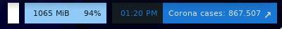
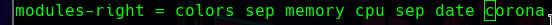

# Corona-polybar
El script te muestra los casos de covid en tu area. 
## Ejemplo de como se muestra.

## Requerimientos
```
python3
```
## Instalación y uso

1. Instala `python3`.
2. Mueve covid.py a la carpeta en donde tienes tus scripts configurados. (Puede ser distino para cada persona, en mi caso estan en "`~/.config/bin`").
3. Añade el script en la configuracion de tu polybar (`~/.config/poybar/config.ini`).
-     Añade la plabra "corona" a la lista de módulos:
     
-    Y ahora copia esto en la parte de [modules]:
```ini
[module/corona]
type = custom/script
interval = 3600
format = <label>
exec = python ~/.config/bin/corona.py spain
```
4. Hacer más bonito el modulo con uso de argumentos.
## Lista de argumentos:

```
usage: covid.py [-h] [-p provincia] [-pre prefijo] [-suf sufijo] [-ar] [-up flecha arriba] [-dw flecha abajo] [-lo] pais

argumentos posicionales:
   country Especifique el país que desea mostrar.

argumentos opcionales:
   -h, --help mostrar este mensaje de ayuda y salir
   -p PROVINCIA, --provincia PROVINCIA
                         Especifique la provincia del país que desea mostrar.
   -pre PREFIX, --prefix PREFIX
                         Especifique un prefijo para la cadena impresa.
   -suf SUFIJO, --sufijo SUFIJO
                         Especifique un sufijo para la cadena impresa.
   -ar, --enable-arrow Habilita el icono de flecha.
   -up FLECHA ARRIBA, - FLECHA ARRIBA ARRIBA
                         Cambie el carácter de flecha 'arriba'.
   -dw FLECHA ABAJO, - flecha abajo FLECHA ABAJO
                         Cambie el carácter de flecha 'hacia abajo'.
   -lo, --enable-locale Habilita los puntos decimales.
```

Obviamente, en el modulo está cargando normal y solo estará cargando numeros (que son los casos). Puedes añadirle los argumentos anteriores en donde carga el script. También puedes hacer que los numeros esten centrados en el módulo, cambiar el fondo, etc.
Quedaría algo así:
```ini
[module/corona]
type = custom/script
interval = 3600
format-background = ${color.shade1}
format-foregound = ${color.fg-alt}
format-padding = 2
exec = python ~/.config/bin/coronaWidget.py spain -p "Madrid" -ar -lo -pre "Corona cases: "
```
Yo lo tengo puesto para "Madrid", ya que en mi provincia no carga la API.


## Créditos.
[api](https://covid19api.com/)
[Aquí](https://api.covid19api.com/countries) puede encontrar el país.

